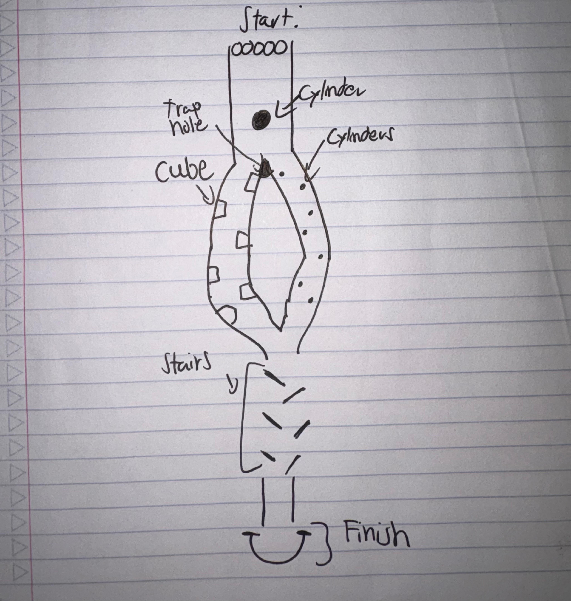

# Marble Race

A 3D marble race game built with Unity's Universal Render Pipeline (URP) template for the *Intro to Video Game Development* class.

## What it is

Simulates a physics based marble race where marbles roll through a track filled with obstacles like:

- Cubes
- Cylinders
- Ramps
- A Roman Arch finish line

The goal is for the marbles to traverse the track and survive, or not survive, the obstacles on their way to the finish line.

## Features

- Built with *Unity 6.5* using the *Universal 3D Template*
- Real time physics driven by Unity's Rigidbody component
- Obstacle course built from primitive GameObjects and interactive track elements
- Automatic marble drop simulation, no player input required

## The Track

The race is laid out in five sections, shown in the sketch above:

1. **Start Section**: the marbles spawn in a row on a slight downhill slope so gravity pulls them forward into the track without needing an initial force applied.
2. **Central Collision Cylinder**: at the bottom of the slope the marbles collide with a Cylinder GameObject placed in the middle of the track. The impact scatters the marbles and pushes them toward the branch point.
3. **Trap Hole**: right after the collision point there is a gap cut into the track mesh. Marbles that hit it at the wrong angle fall through and are eliminated from the race, adding an element of chance.
4. **Branching Paths**: the track splits into a left path lined with Cube obstacles and a right path lined with Cylinder obstacles, forcing marbles to weave around a different obstacle shape depending on which side they end up on.
5. **Stairs and Finish Arch**: both paths converge back into a single staircase made of stacked Cube steps, which the marbles bounce down before rolling through a Roman Arch that marks the finish line.

## Development Process

- **Start Section**: placed a single marble prefab, duplicated it in a straight line using Unity's transform position offsets to create the starting row, then built the slope and track walls out of Cube primitives, scaling and rotating them to warp the flat cubes into ramps and guide rails. All geometry was built using primitive GameObjects since custom meshes were outside the scope of the assignment.
- **Central Collision Cylinder and Trap Hole**: modeled the collision piece with a Cylinder primitive and used a Box Collider with a gap in the track mesh to create the trap hole, testing marble mass and drag until the fall through felt fair rather than random.
- **Branching Paths**: built the left path's Cube obstacles and the right path's Cylinder obstacles as separate prefab sets, spacing them along the track so both paths have a comparable difficulty curve.
- **Stairs and Finish Arch**: assembled the staircase from stacked Cube steps and closed out the track with the Roman Arch, tuning Rigidbody physics materials so marbles keep momentum down the stairs instead of getting stuck on the edges.

## Challenges

- **Merging individual work into one scene**: since we each worked on separate sections of the track locally, syncing everyone's GameObjects, Prefabs, and scene changes into a single working scene was harder than expected. If we had shared access through linked GitHub accounts from the start, we could have worked on the project simultaneously and had a clearer picture of how the full track fit together earlier in development.
- **Getting the course to function correctly**: getting marbles to reliably roll through every section, collide with obstacles as intended, and reach the finish line without clipping through geometry or getting stuck took a lot of iteration on colliders, Rigidbody settings, and physics materials.

## A Note on Working with Unity

Working on this project was our first real experience building something with Unity as a full team rather than individually, and it was interesting to see how much of "unity" the engine actually demands, not just in the coding sense but in coordinating a shared scene, agreeing on scale and naming conventions for GameObjects, and making sure everyone's obstacle pieces lined up with the track as a whole. It was a good introduction to how physics based gameplay depends less on scripting and more on tuning, small changes to a Rigidbody's mass, drag, or a collider's shape could completely change how the marbles behaved, and getting the marble race to feel right meant testing and retesting the same handful of components over and over. It also gave us a better appreciation for version control on a game project specifically, since Unity's scene and meta files do not merge the way code does.

## What it needs to work

To open and run this project it needs:

- **Unity 6.5** or newer *(older versions may work but are not tested)*
- The **Universal Render Pipeline (URP)** package, included in the template
- A device capable of running Unity
- When the project opens, simply press Play on the scene so the game executes automatically, the marbles will drop and race, no user input needed

### Future Work

- Add more track sections and obstacles
- Give the marbles distinct colors so they are easier to tell apart during a race
- Add a way to track which marble wins the most races across multiple runs
- Add user input for marble selection or path selection, letting the player choose a track path by number and pick the color of the marble they want
- Develop a co op mode where players can control their own marble and race against friends, similar in spirit to Mario Kart but with marbles

## Credits

- Jahir Mercado
- Adryel Robles
- Lianyeli Quinones De Jesus

Intro to Video Game Development class

### This project is for educational purposes only.
